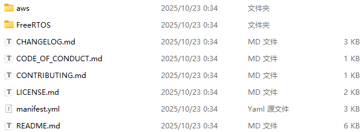
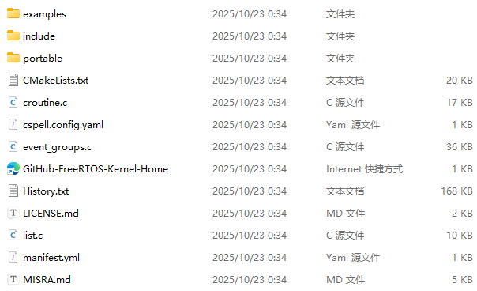
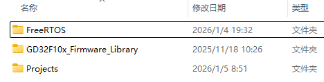
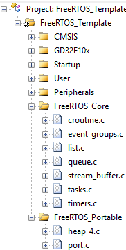
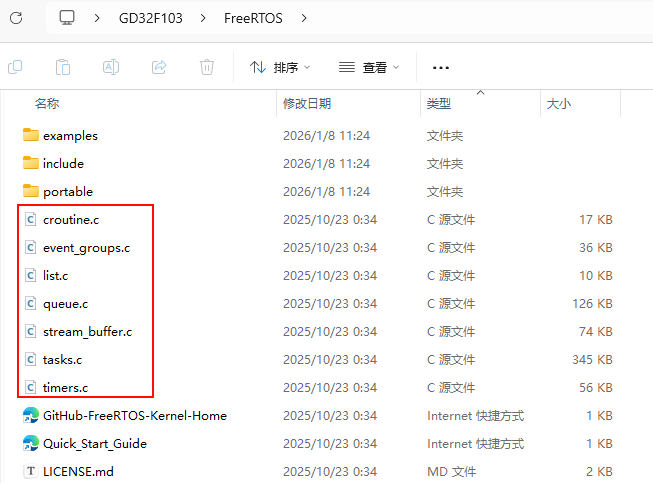
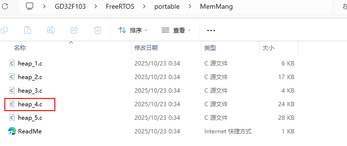
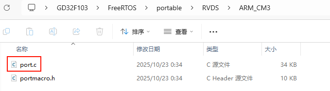
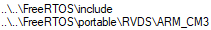
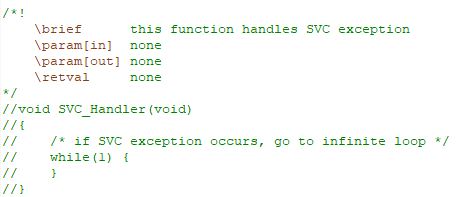
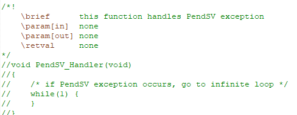

# GD32F103移植FreeRTOS

## 1. 版本说明

FreeRTOS Kernel V11.1.0

GD32F10x V2.5.0

## 2. 移植过程

### 2.1 FreeRTOS 系统源码

前往FreeRTOS官网获取FreeRTOS的系统源码

[FreeRTOS](https://www.freertos.org/)

### 2.2 FreeRTOS 移植

#### 2.2.1 向工程中添加FreeRTOS源码

FreeRTOS官网获取到的压缩包解压后如下



我们只需要/FreeRTOS/FreeRTOS-Kernel中的内容



将FreeRTOS-Kernel这个文件夹复制到与GD32F10x_Firmware_Library的同级目录中并重命名为FreeRTOS




在keil工程中添加文件，新建FreeRTOS_Core和FreeRTOS_Portable文件夹，并添加如下.c文件



FreeRTOS_Core中的文件在FreeRTOS目录中



FreeRTOS_Portable中的heap_4.c文件在FreeRTOS/portable/MemMang目录中



FreeRTOS_Portable中的port.c文件在FreeRTOS/portable/RVDS/ARM_CM3目录中




在C/C++选项卡中添加头文件路径



#### 2.2.2 代码修改适配

在项目中添加FreeRTOSConfig.h，保存路径为FreeRTOS/include

FreeRTOSConfig.h中的内容为

```c
#ifndef FREERTOS_CONFIG_H
#define FREERTOS_CONFIG_H

#include <stdio.h>

//针对不同的编译器调用不同的stdint.h文件
#if defined(__ICCARM__) || defined(__CC_ARM) || defined(__GNUC__)
	#include <stdint.h>
	extern uint32_t SystemCoreClock;
#endif


//断言
#define vAssertCalled(char,int) printf("Error:%s,%d\r\n",char,int)
#define configASSERT(x) if((x)==0) vAssertCalled(__FILE__,__LINE__)

/***************************************************************************************************************/
/*                                        FreeRTOS基础配置配置选项                                              */
/***************************************************************************************************************/
#define configUSE_PREEMPTION					1                       //1使用抢占式内核，0使用协程
#define configUSE_TIME_SLICING					1						//1使能时间片调度(默认式使能的)
#define configUSE_PORT_OPTIMISED_TASK_SELECTION	1                       //1启用特殊方法来选择下一个要运行的任务
                                                                        //一般是硬件计算前导零指令，如果所使用的
                                                                        //MCU没有这些硬件指令的话此宏应该设置为0！
#define configUSE_TICKLESS_IDLE					0                       //1启用低功耗tickless模式
#define configUSE_QUEUE_SETS					1                       //为1时启用队列
#define configCPU_CLOCK_HZ						(SystemCoreClock)       //CPU频率
#define configTICK_RATE_HZ						(1000)                  //时钟节拍频率，这里设置为1000，周期就是1ms
#define configMAX_PRIORITIES					(32)                    //可使用的最大优先级
#define configMINIMAL_STACK_SIZE				((unsigned short)130)   //空闲任务使用的堆栈大小
#define configMAX_TASK_NAME_LEN					(16)                    //任务名字字符串长度

#define configUSE_16_BIT_TICKS					0                       //系统节拍计数器变量数据类型，
                                                                        //1表示为16位无符号整形，0表示为32位无符号整形
#define configIDLE_SHOULD_YIELD					1                       //为1时空闲任务放弃CPU使用权给其他同优先级的用户任务
#define configUSE_TASK_NOTIFICATIONS            1                       //为1时开启任务通知功能，默认开启
#define configUSE_MUTEXES						1                       //为1时使用互斥信号量
#define configQUEUE_REGISTRY_SIZE				8                       //不为0时表示启用队列记录，具体的值是可以
                                                                        //记录的队列和信号量最大数目。
#define configCHECK_FOR_STACK_OVERFLOW			0                       //大于0时启用堆栈溢出检测功能，如果使用此功能
                                                                        //用户必须提供一个栈溢出钩子函数，如果使用的话
                                                                        //此值可以为1或者2，因为有两种栈溢出检测方法。
#define configUSE_RECURSIVE_MUTEXES				1                       //为1时使用递归互斥信号量
#define configUSE_MALLOC_FAILED_HOOK			0                       //1使用内存申请失败钩子函数
#define configUSE_APPLICATION_TASK_TAG			0                       
#define configUSE_COUNTING_SEMAPHORES			1                       //为1时使用计数信号量

/***************************************************************************************************************/
/*                                FreeRTOS与内存申请有关配置选项                                                */
/***************************************************************************************************************/
#define configSUPPORT_DYNAMIC_ALLOCATION        1                       //支持动态内存申请
#define configTOTAL_HEAP_SIZE					((size_t)(5*1024))     //系统所有总的堆大小

/***************************************************************************************************************/
/*                                FreeRTOS与钩子函数有关的配置选项                                              */
/***************************************************************************************************************/
#define configUSE_IDLE_HOOK						0                       //1，使用空闲钩子；0，不使用
#define configUSE_TICK_HOOK						0                       //1，使用时间片钩子；0，不使用

/***************************************************************************************************************/
/*                                FreeRTOS与运行时间和任务状态收集有关的配置选项                                 */
/***************************************************************************************************************/
#define configGENERATE_RUN_TIME_STATS	        0                       //为1时启用运行时间统计功能
#define configUSE_TRACE_FACILITY				1                       //为1启用可视化跟踪调试
#define configUSE_STATS_FORMATTING_FUNCTIONS	1                       //与宏configUSE_TRACE_FACILITY同时为1时会编译下面3个函数
                                                                        //prvWriteNameToBuffer(),vTaskList(),
                                                                        //vTaskGetRunTimeStats()
                                                                        
/***************************************************************************************************************/
/*                                FreeRTOS与协程有关的配置选项                                                  */
/***************************************************************************************************************/
#define configUSE_CO_ROUTINES 			        0                       //为1时启用协程，启用协程以后必须添加文件croutine.c
#define configMAX_CO_ROUTINE_PRIORITIES         ( 2 )                   //协程的有效优先级数目

/***************************************************************************************************************/
/*                                FreeRTOS与软件定时器有关的配置选项                                            */
/***************************************************************************************************************/
#define configUSE_TIMERS				        1                               //为1时启用软件定时器
#define configTIMER_TASK_PRIORITY		        (configMAX_PRIORITIES-1)        //软件定时器优先级
#define configTIMER_QUEUE_LENGTH		        5                               //软件定时器队列长度
#define configTIMER_TASK_STACK_DEPTH	        (configMINIMAL_STACK_SIZE*2)    //软件定时器任务堆栈大小

/***************************************************************************************************************/
/*                                FreeRTOS可选函数配置选项                                                      */
/***************************************************************************************************************/
#define INCLUDE_xTaskGetSchedulerState          1                       
#define INCLUDE_vTaskPrioritySet		        1
#define INCLUDE_uxTaskPriorityGet		        1
#define INCLUDE_vTaskDelete				        1
#define INCLUDE_vTaskCleanUpResources	        1
#define INCLUDE_vTaskSuspend			        1
#define INCLUDE_vTaskDelayUntil			        1
#define INCLUDE_vTaskDelay				        1
#define INCLUDE_eTaskGetState			        1
#define INCLUDE_xTimerPendFunctionCall	        1

/***************************************************************************************************************/
/*                                FreeRTOS与中断有关的配置选项                                                  */
/***************************************************************************************************************/
#ifdef __NVIC_PRIO_BITS
	#define configPRIO_BITS       		__NVIC_PRIO_BITS
#else
	#define configPRIO_BITS       		4                  
#endif

#define configLIBRARY_LOWEST_INTERRUPT_PRIORITY			15                      //中断最低优先级
#define configLIBRARY_MAX_SYSCALL_INTERRUPT_PRIORITY	5                       //系统可管理的最高中断优先级
#define configKERNEL_INTERRUPT_PRIORITY 		( configLIBRARY_LOWEST_INTERRUPT_PRIORITY << (8 - configPRIO_BITS) )
#define configMAX_SYSCALL_INTERRUPT_PRIORITY 	( configLIBRARY_MAX_SYSCALL_INTERRUPT_PRIORITY << (8 - configPRIO_BITS) )

/***************************************************************************************************************/
/*                                FreeRTOS与中断服务函数有关的配置选项                                          */
/***************************************************************************************************************/
#define xPortPendSVHandler 	PendSV_Handler
#define vPortSVCHandler 	SVC_Handler

#endif /* FREERTOS_CONFIG_H */
```

修改systick.c中的文件为

```c
#include "gd32f10x.h"
#include "systick.h"

volatile static uint32_t delay;

/*!
    \brief      configure systick
    \param[in]  none
    \param[out] none
    \retval     none
*/
void systick_config(void)
{
		uint32_t Sys_clk = rcu_clock_freq_get(CK_SYS);
    /* setup systick timer for 1000Hz interrupts*/
    if (SysTick_Config( Sys_clk/ configTICK_RATE_HZ)){
        /* capture error */
        while (1){
        }
    }
    /* configure the systick handler priority */
    NVIC_SetPriority(SysTick_IRQn, 0x00U);
}
```

在gd32f10x_it.c中注释掉SVC_Handler和PendSV_Handler两个函数





并将SysTick_Handler函数修改为

```c
void SysTick_Handler(void)
  {
		#if (INCLUDE_xTaskGetSchedulerState  == 1 )
			if (xTaskGetSchedulerState() != taskSCHEDULER_NOT_STARTED)
			{
		#endif   
				xPortSysTickHandler();
		#if (INCLUDE_xTaskGetSchedulerState  == 1 )
			}
		#endif   
  } 
```

### 2.3 添加任务进行测试

```c
#include "main.h"

//任务优先级
#define START_TASK_PRIO		1
//任务堆栈大小	
#define START_STK_SIZE 		128  
//任务句柄
TaskHandle_t StartTask_Handler;
//任务函数
void start_task(void *pvParameters);

//任务优先级
#define LED_TASK_PRIO		2
//任务堆栈大小	
#define LED_STK_SIZE 		50  
//任务句柄
TaskHandle_t LEDTask_Handler;
//任务函数
void led_task(void *pvParameters);

//任务优先级
#define UART_TASK_PRIO		3
//任务堆栈大小	
#define UART_STK_SIZE 		50  
//任务句柄
TaskHandle_t UARTTask_Handler;
//任务函数
void uart_task(void *pvParameters);

void LED_Task(void *pvParameters)
{
    while(1)
    {
      led_toggle();
      vTaskDelay(500);
    }
} 

/*!
    \brief      main function
    \param[in]  none
    \param[out] none
    \retval     none
*/
int main(void)
{
    /* initialize the LEDs */
    led_init();
    
    /* configure systick */
    systick_config();
		uart_init(115200u);
	//创建开始任务
    xTaskCreate((TaskFunction_t )start_task,            //任务函数
                (const char*    )"start_task",          //任务名称
                (uint16_t       )START_STK_SIZE,        //任务堆栈大小
                (void*          )NULL,                  //传递给任务函数的参数
                (UBaseType_t    )START_TASK_PRIO,       //任务优先级
                (TaskHandle_t*  )&StartTask_Handler);   //任务句柄              
    vTaskStartScheduler();          //开启任务调度

}

//开始任务任务函数
void start_task(void *pvParameters)
{
    taskENTER_CRITICAL();           //进入临界区
    //创建LED任务
    xTaskCreate((TaskFunction_t )led_task,     	
                (const char*    )"led_task",   	
                (uint16_t       )LED_STK_SIZE, 
                (void*          )NULL,				
                (UBaseType_t    )LED_TASK_PRIO,	
                (TaskHandle_t*  )&LEDTask_Handler);  

    xTaskCreate((TaskFunction_t )uart_task,     	
                (const char*    )"uart_task",   	
                (uint16_t       )UART_STK_SIZE, 
                (void*          )NULL,				
                (UBaseType_t    )UART_TASK_PRIO,	
                (TaskHandle_t*  )&UARTTask_Handler);
								
    vTaskDelete(StartTask_Handler); //删除开始任务
    taskEXIT_CRITICAL();            //退出临界区
}

//LED0任务函数 
void led_task(void *pvParameters)
{
    while(1)
    {
        led_toggle();
        vTaskDelay(500);
    }
}

void uart_task(void *pvParameters)
{
    while(1)
    {
        printf("\r\n Hello FreeRTOS \r\n");
        vTaskDelay(500);
    }
}  

/* retarget the C library printf function to the USART */
int fputc(int ch, FILE *f)
{
    usart_data_transmit(USART0, (uint8_t)ch);
    while(RESET == usart_flag_get(USART0, USART_FLAG_TBE));
    return ch;
}
```


